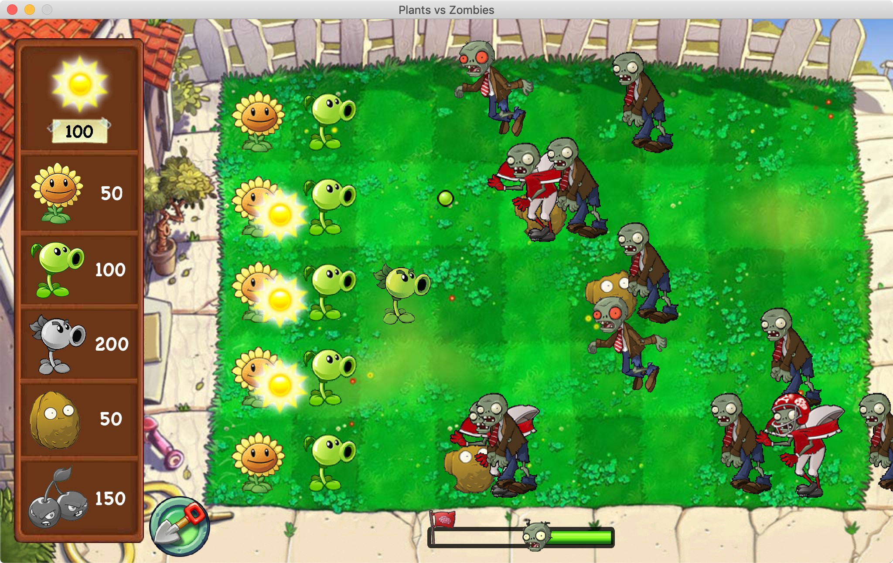
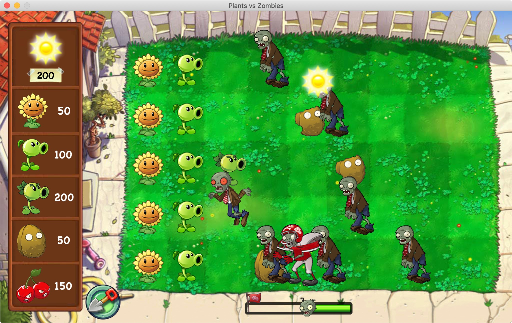

# Plants vs Zombies
Java Swing PVZ Game

## Welcome to Plants vs Zombies!

### Please read before playing:
1. This game needs mouse to operate. Make sure you have the right input device.
2. This game equipped with in-game sound effects. Make sure to turn your volume on.

### How to run the game:
Just open PVZ.jar file
#### or compile java files:
1. Go to src folder
2. Open command prompt (Windows) or terminal (macOS)
3. Compile all java files with command:  
   `javac Main.java World.java Actor.java Audio.java Plant.java Zombie.java Player.java Pea.java Sun.java Point.java`
4. Run the program with command: `java Main`
5. Enjoy!

### Tips:
After compiling all java files, you can create a jar file
1. Put PVZ.mf file in the compiled .class folder
2. Create jar file with command:
   `jar cmf PVZ.mf PVZ.jar *.class Assets`
3. Run the program by simply double clicking PVZ.jar file

### About the game:
This game looks like distinguished "Plants vs Zombies". Your goal is to protect a house from zombies invasion. The house is located on the left and zombies will come from the right. You can use several kinds of plants to kill and stop zombies from getting into the house. You win if all zombies are killed and no zombie gets into the house. If any zombie reaches the house, you will lose.

The game starts with 50 sunflower points. A sun will fall from the sky every 5 seconds. The sun is worth 25 sunflower points.
There are 20 zombies in the first wave and 30 zombies later, making a total of 50 zombies.

#### Game's characters and statistics:

| **PLANTS** | Sunflower | Peashooter | Repeater | Wallnut | Cherrybomb |
| :----------: | :----------: | :----------: | :----------: | :----------: | :----------: |
| Description | Produce 1 sun every 10 seconds | Shoot 1 pea every 2 seconds | Shoot 2 peas every 2 seconds | Block zombies except Flying Zombie | Explode and kill all zombies around |
| Price | 50 | 100 | 200 | 50 | 150 |
| Health | 50 | 50 | 70 | 300 | 200 |
| Damage | - | 6 | 5x2 | - | Massive |

| **ZOMBIES** | Normal Zombie | Football Zombie | Flying Zombie |
| :----------: | :----------: | :----------: | :----------: |
| Description | Just a normal zombie | Have double protection from helmet | Fly through any plant on the field   It can't eat the plant either |
| Health | 50 | 90 | 60 |
| Damage | 12 | 15 | - |
| Speed | 0.3 | 0.5 | 0.4 |

## Screenshots:
### Main Menu

### Game

### Gameplay 1

### Gameplay 2

